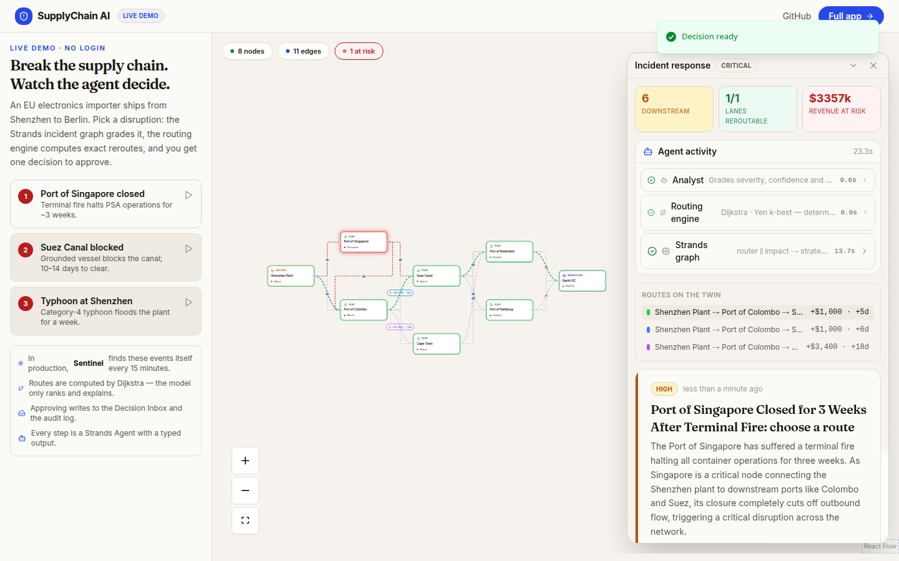
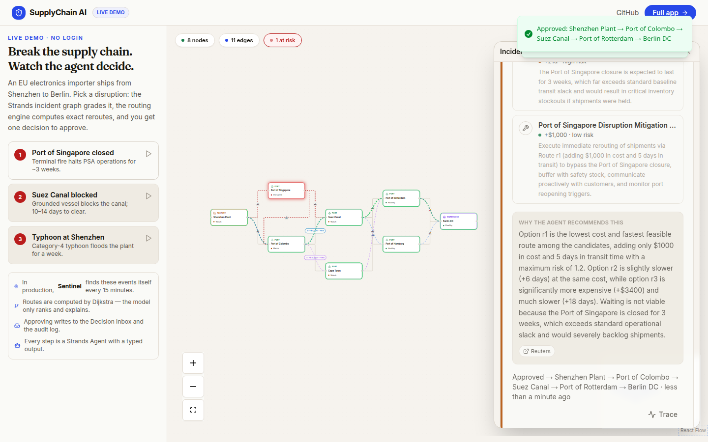
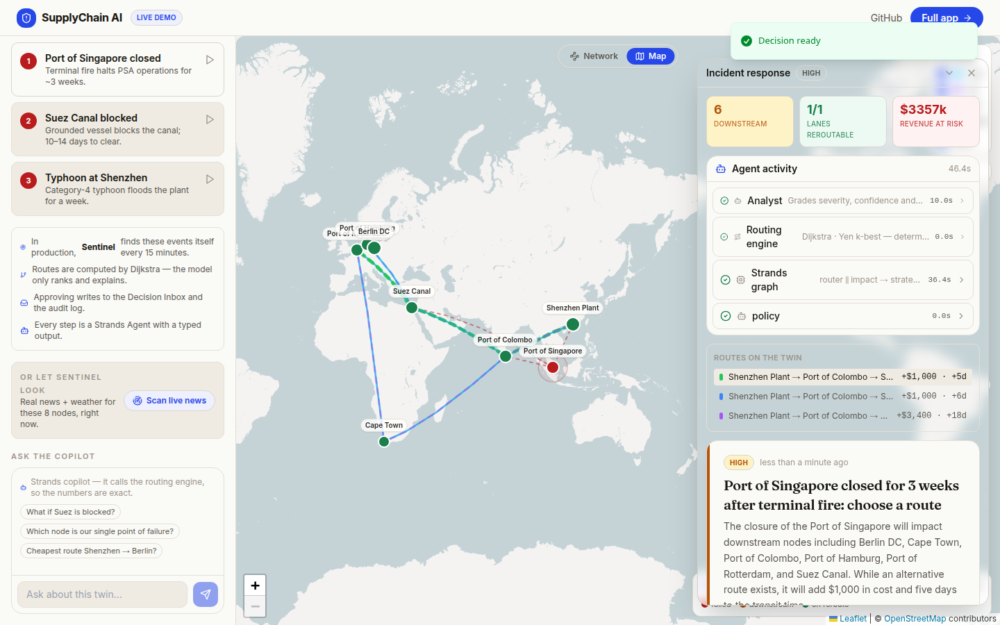
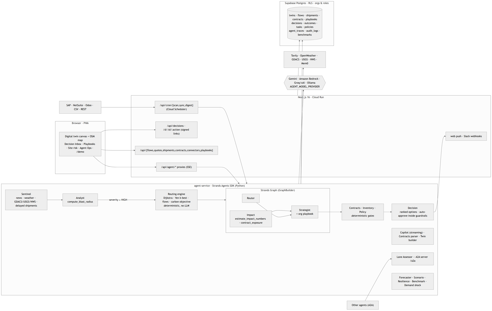
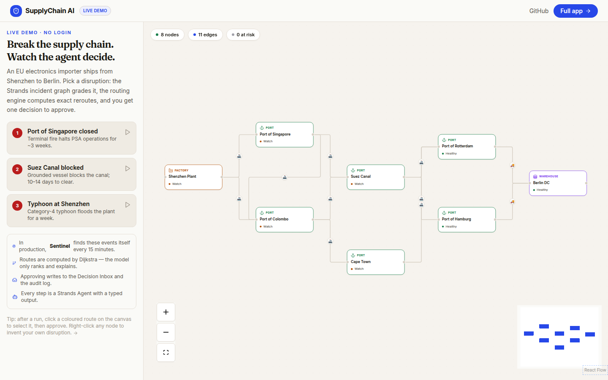
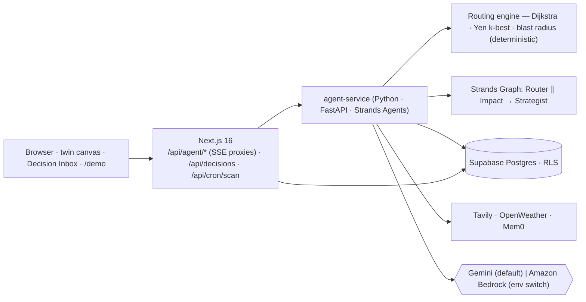

<p align="center">
  <h1 align="center">SupplyChain AI</h1>
  <p align="center"><strong>An autonomous supply-chain resilience agent. It watches your network 24/7 and only interrupts you with a decision.</strong></p>
  <p align="center">
    <a href="https://strandsagents.com"></a>
    <a href="LICENSE"></a>
    
    
  </p>
</p>

> **Live demo (no login):** `<LIVE_URL>/demo` · **Video (5 min):** `<VIDEO_URL>` · **Track:** Agents for Humans → *Professional Agents*

---

## Try it in 30 seconds

1. Open **`/demo`**. You get a real twin: an EU electronics importer shipping Shenzhen → Singapore → Suez → Rotterdam → Berlin.
2. Click **"Port of Singapore closed"**.
3. Watch the Strands incident graph run live — *Analyst → routing engine → Router ∥ Impact → Strategist* — the failed port pulse red, three exact reroutes get drawn on the map, and one **decision card** appears: `Shenzhen → Colombo → Suez → Rotterdam → Berlin (+$1,000, +5 days, low risk)` vs *wait* vs *mitigate*, with the agent's rationale and sources.
4. Click **Approve**. In the full app that writes the decision, the audit log and a notification; the agent remembers it for next time.

Then ask the copilot in the sidebar: *"What if Suez is blocked?"* — it calls the deterministic routing tools and answers with exact numbers. Or press **Scan live news** and let Sentinel find real events for these eight nodes right now.

<p align="center">
  
  
</p>
<p align="center"><sub>Left: the incident graph has run — Analyst 9.6 s · routing engine 0.0 s · Strands graph 13.4 s — three candidate routes are drawn, one decision card. Right: approved, with the Router's rationale and sources.</sub></p>

## The problem

Operations and logistics managers at small and mid-size manufacturers and importers find out about a port closure, a strike or a typhoon **from the news**, then spend a day in spreadsheets working out what it hits, what the alternatives cost, and who to call. It is repetitive, judgement-heavy, and it happens at 2 a.m.

## What the agent does

| Background (nobody watching) | When it matters (you are asked once) |
|---|---|
| **Sentinel** scans news and weather for every node and lane of every twin, every 15 minutes (Cloud Scheduler → `/api/cron/scan`). | **Decision Inbox**: one card per incident with ranked options, exact cost/time/risk deltas, the recommendation, the rationale, sources, and a confidence badge. |
| **Analyst** grades each candidate event against *your* twin: severity, confidence, blast radius. Below `HIGH` it is logged as an alert and nobody is interrupted. | **Approve / Reject / Snooze** — approval records the choice, notifies the team and feeds the agent's memory. |
| **Routing engine** (pure Python: Dijkstra, Yen's k-shortest, blast radius) computes the real alternatives. The LLM never invents a route or a number. | **Incident view on the twin**: failed node, downstream nodes, candidate routes in colour, click to pick. |
| **Router ∥ Impact → Strategist** run as a **Strands Graph** and produce typed outputs: ranking + trade-offs, revenue at risk, an executable mitigation plan. | **Trace drawer**: every agent run (duration, tokens) from `agent_traces` — auditable, not a black box. |

Who it is for: the person who owns "keep the goods moving" at a company with 5–50 suppliers and no control tower. Why it matters: one avoided week of stock-out pays for years of this.

## Built for a real network, not just a demo

| Onboarding | Autonomy & operations |
|---|---|
| **Describe in words** — a Strands `twin_builder` agent drafts sites and lanes from plain English; **Import CSV/Excel**; **industry templates** (electronics, automotive, pharma cold chain, F&B). | **Autonomy policy** per twin — auto-approve reroutes ≤ $X / ≤ N days at ≥ confidence; never on `needs_review` or when a lane has no bypass. Every auto-approval is audited, remembered and notified. |
| **Geocoding + lane estimation** — sites without coordinates are geocoded; lanes without cost/days are estimated from great-circle distance × a mode rate card and flagged *estimated*, so routing never sees a free lane. | **Slack / Teams / webhook** notifications with deep links; **decision SLA** — pending decisions expire per policy. |
| **Geo view** — Leaflet + OpenStreetMap, great-circle lanes by mode, incident overlay (failed / downstream / candidate routes). | **Agent Ops** — every run traced (duration, tokens, failures, cost estimate) with CSV exports of decisions, audit, traces and alerts. |
| **Resilience audit** — fails every site and lane one at a time (pure routing math), ranks fragility, names single points of failure, scores the network 0–100; "Fail it" runs the incident graph for any case. | **Execution checklist** — the Strategist's steps become trackable tasks on every decision; **evidence panel** shows the routing engine's candidates and the policy verdict behind each recommendation. |
| **Data health** — lint on every twin (missing coordinates, free lanes, orphans, duplicates) with fixes. **Flows** (units, value, penalties, days of cover) make impact and reroute cost flow-weighted; **rate cards** per org and **carrier quotes** per lane replace estimates with real prices. | **Orgs & roles** (owner / approver / planner / viewer), approve from Slack with signed one-click links, **web push** (PWA) at 2 a.m., weekly **digest** with the cost of inaction. |
| **ERP / TMS connectors** — generic REST, CSV URL, SAP OData, NetSuite SuiteQL, Odoo JSON-RPC presets; scheduled sync of flows and shipments. **Shipments in flight** with carrier milestone webhooks; Sentinel treats a delayed shipment as an event. | **Playbooks** — six built-in disruption responses (port closure, supplier outage, storm, chokepoint, customs, strike) the org installs and edits; the Strategist follows them and their steps seed the checklist. |
| **Contracts & SLAs** — paste a clause, the Contracts agent extracts lead time / grace / penalty per day / cap; penalties are added deterministically to every impact estimate. | **Learning from outcomes** — record what a decision really cost; estimate accuracy (MAPE, bias) on Agent Ops; estimated lanes are calibrated by the observed bias. |
| **Public hazard feeds** — GDACS, USGS and NWS alerts (keyless) filtered to the twin's sites, as Sentinel tools. | **Carbon & cost co-optimisation** — CO₂e per lane from the rate card; a policy slider weighs carbon in the routing objective; every option shows its tCO₂e delta. |
| **Demand shock** — scale demand on flows: which lanes saturate, cost to serve, stock-out timing. **Inventory model** — "wait and monitor" is only viable when days of cover outlast the expected outage. | **A2A endpoint** — other agents ask *"is this lane safe?"* over the Agent-to-Agent protocol with org API keys; **benchmarking** — resilience percentile vs anonymised peers; **multi-region** agent-service routing by org. |
| **Guided tour** — a spotlight walkthrough of every tab and control starts on first sign-in (replay from Profile or the `?` in the header). | Roadmap and what shipped: [`docs/ROADMAP.md`](docs/ROADMAP.md). |

<p align="center"></p>

## Architecture



<p align="center"></p>



Two services, one contract:

- **`agent-service/`** — every LLM call in the product. FastAPI on port 8080, plus the **Amazon Bedrock AgentCore Runtime contract** (`POST /invocations`, `GET /ping`) so the same container deploys to AgentCore unchanged (`agent-service/agentcore_entry.py`).
- **Next.js app** — twin canvas, Decision Inbox, alerts, simulation and forecast screens. `app/api/agent/*` are thin proxies (SSE passthrough) so the UI never talks to a model directly.

Full details: [`docs/ARCHITECTURE.md`](docs/ARCHITECTURE.md) · deployment: [`docs/DEPLOYMENT.md`](docs/DEPLOYMENT.md).

## How Strands is used

| Agent (`agent-service/agents/`) | Tools (`@tool`) | Typed output (Pydantic) | Where it runs |
|---|---|---|---|
| `sentinel` | `search_news`, `get_weather` | `EventList` | `/scan` (background loop) |
| `analyst` | `compute_blast_radius` | `Assessment` | stage 1 of the incident graph |
| `router` | — (receives engine candidates) | `RouteRanking` | node in the **incident Graph** |
| `impact` | `estimate_impact_numbers` | `ImpactEstimate` | node in the incident Graph |
| `strategist` | `recall_memory` | `MitigationPlan` | node in the incident Graph |
| `forecaster`, `scenario` | `search_news`, `recall_memory` | `Forecast`, `ScenarioSet` | analysis Graph + report screens |
| `copilot` | all twin/intel/memory tools | streamed via `Agent.stream_async` | chat (`/chat`) |
| `reports.*` (`simulation`, `strategy_report`, `forecast_report`, `live_intel`) | deterministic facts injected | UI report schemas | simulation / strategy / forecast / live-intel screens |

- **Multi-agent orchestration with `strands.multiagent.GraphBuilder`** — [`graphs/incident.py`](agent-service/graphs/incident.py) (`router ∥ impact → strategist`, two entry points, execution order captured for the UI) and [`graphs/analysis.py`](agent-service/graphs/analysis.py) (`intel → forecast ∥ scenario → strategy → report`).
- **Structured output everywhere** — `structured_output_model` on every call and on Graph nodes; large nested reports fall back to Gemini JSON mode and are validated with Pydantic (`agents/base.py`).
- **Hooks for observability** — [`tracing.py`](agent-service/tracing.py) registers `BeforeInvocationEvent`/`AfterInvocationEvent` and writes one `agent_traces` row per agent run (session, duration, tokens). The Decision Inbox's *Trace* drawer reads them.
- **Resilience** — `models.invoke_with_retry` rotates API keys, then falls back across models on 429/503; graph failures degrade to a deterministic, `needs_review` decision instead of an error. News comes from Tavily when a key has credits and otherwise from **Gemini's built-in Google Search grounding** (`GeminiModel(gemini_tools=[GoogleSearch])`), so Sentinel never goes blind.
- **Learning loop** — every approved/rejected decision is written to Mem0 (`POST /memory`); the Analyst recalls it and the next decision card shows *"Last time this happened"*.
- **Conversation state** — the copilot keeps multi-turn history with `SlidingWindowConversationManager`.
- **Provider switch** — `AGENT_MODEL_PROVIDER=gemini|bedrock|openai`. Bedrock uses `BedrockModel` (`us.anthropic.claude-sonnet-4-6` by default); `openai` uses `OpenAIModel` against any OpenAI-compatible endpoint (OpenAI, Groq, xAI Grok); `ollama` uses `OllamaModel` for fully local inference (tested with `qwen2.5:7b`). Nothing else changes.
- **AgentCore-ready** — `/invocations` dispatches on `payload.action` (`incident`, `scan`, `reroute`, `analysis`, `chat`, …).

### Why the routing is deterministic

Operators will act on these numbers. `agent-service/routing.py` computes blast radius, k-best alternate lanes (Yen on Dijkstra) and exact added cost/days, and the Router agent only ranks and explains. Unit-tested: `agent-service/tests/test_routing.py`.

## Run locally

```bash
# 1. agent-service (Python 3.10+, uv)
cd agent-service
uv sync --extra dev --extra memory
cp .env.example .env        # GOOGLE_API_KEY (or AWS creds + AGENT_MODEL_PROVIDER=bedrock), SUPABASE_*, TAVILY, OPENWEATHER
uv run pytest               # 26 tests, no network
uv run python app.py        # http://localhost:8080/ping

# 2. web app
cd ..
pnpm install
cp .env.example .env.local  # Supabase keys, AGENT_SERVICE_URL/SECRET, CRON_SECRET
pnpm test                   # vitest
pnpm dev                    # http://localhost:3000/demo works without a database
```

Database: run **`supabase/setup.sql`** once in the Supabase SQL editor (all tables, RLS, auth trigger — idempotent), or `npx supabase start` for a local stack (it applies `supabase/migrations/` automatically).

## Environment variables

| Variable | Where | Purpose |
|---|---|---|
| `AGENT_MODEL_PROVIDER` | agent-service | `gemini` (default), `bedrock`, `openai` (any OpenAI-compatible API: OpenAI, Groq, xAI Grok), or `ollama` (local models) |
| `OLLAMA_HOST`, `OLLAMA_MODEL_ID` | agent-service | for `ollama`, e.g. `qwen2.5:7b` (runs the whole pipeline on a 6 GB laptop GPU) |
| `OPENAI_API_KEY`, `OPENAI_BASE_URL`, `OPENAI_MODEL_ID` | agent-service | for `openai` provider, e.g. Groq: `https://api.groq.com/openai/v1` + `llama-3.3-70b-versatile` |
| `GEMINI_MODEL_ID`, `GOOGLE_API_KEY[_AGENTS|_ORCHESTRATOR]` | agent-service | Gemini model + keys (rotated on quota) |
| `BEDROCK_MODEL_ID`, `AWS_REGION` (+ AWS credentials) | agent-service | Bedrock model |
| `SUPABASE_URL`, `SUPABASE_SERVICE_ROLE_KEY` | both | data + traces |
| `TAVILY_API_KEY`, `OPENWEATHER_API_KEY`, `MEM0_API_KEY` | agent-service | news, weather, memory (all optional — tools degrade gracefully) |
| `AGENT_SERVICE_URL`, `AGENT_SERVICE_SECRET` | web | how Next.js reaches the agents |
| `CRON_SECRET` | web | protects `/api/cron/scan` |

## Runs on AWS

The service is built on **Strands Agents** and runs natively on AWS: `AGENT_MODEL_PROVIDER=bedrock` switches every agent to
**Amazon Bedrock** (`BedrockModel`, cross-region inference profile), and the same container deploys to **Amazon Bedrock
AgentCore Runtime** through `agent-service/agentcore_entry.py` (`POST /invocations`, `GET /ping`). IAM policy, execution role,
EventBridge schedule and a one-shot deploy script live in [`infra/aws/`](infra/aws/). Cloud Run / Railway / Render / Vercel
are supported for teams outside AWS — see [`docs/DEPLOYMENT.md`](docs/DEPLOYMENT.md).

## Deploy

- **Cloud Run** (current): `pnpm deploy:agents` then `pnpm deploy:gcp`; a Cloud Scheduler job calls `/api/cron/scan` every 15 minutes. See [`docs/DEPLOYMENT.md`](docs/DEPLOYMENT.md).
- **Amazon Bedrock AgentCore**: `pip install bedrock-agentcore-starter-toolkit && cd agent-service && agentcore configure -e agentcore_entry.py && agentcore launch`, then point `AGENT_SERVICE_URL` at the runtime. Set `AGENT_MODEL_PROVIDER=bedrock`.

## Tests

- `agent-service` (80 tests): routing (Dijkstra, Yen, blast radius, lane detection, flows, carbon objective), inventory, contracts, playbooks, calibration, benchmark, demand shock, hazard feeds (mocked HTTP), lane tools, schemas, agent post-processing, graph gates, API (`TestClient`).
- web (34 tests): SSE parser (incl. CRLF), decision formatting, CSV/Excel twin import, tracking provider, connectors (presets, CSV, mapping, site resolution).

## Disclosure

The digital-twin canvas, Supabase schema and simulation screens come from the author's earlier open-source work. Everything the agent does was built during the hackathon: the Strands `agent-service` (agents, tools, graphs, hooks, provider switch, AgentCore contract), the deterministic routing engine, the Decision Inbox and incident view, the background scan loop, the public demo, and these docs.

## License

MIT — see [LICENSE](LICENSE).
